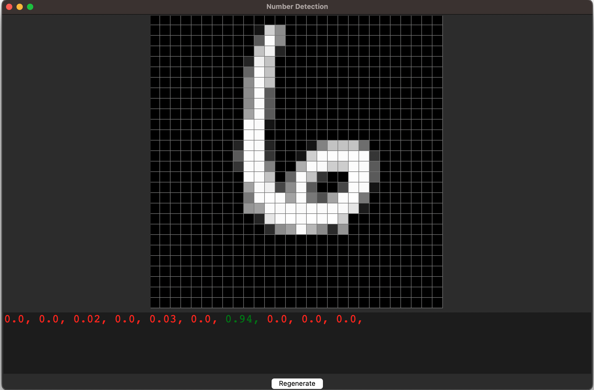

# Number Detection :

## File

Here is the list of the file in this project and what they are used for :

- **numberDetection.py** : This file contain the code to train and test the IA in number detection. **use -c command to show help**

- **numberDetectionTools.py** : This file contain function used in **numberDetection.py** and **UI.py**

- **UI.py** : Use this file to see the number wich are given to the IA