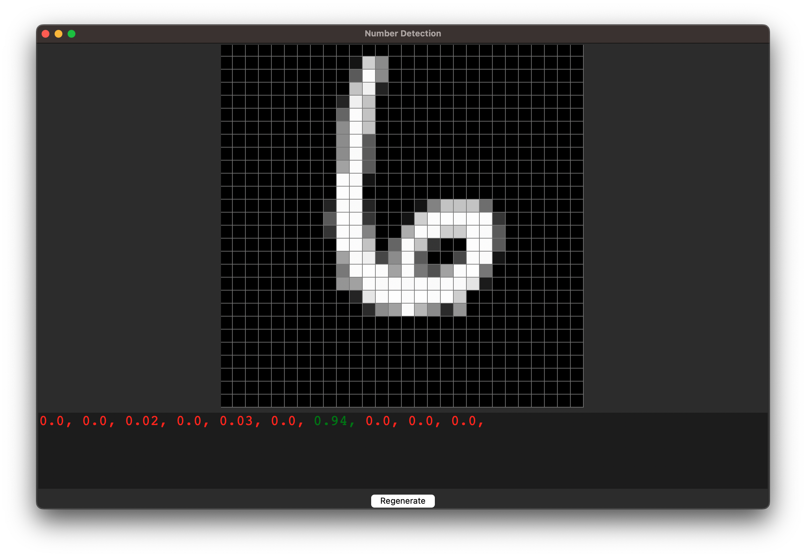

# Multilayer Perceptron from scratch

# Presentation

This project aim to help me understanding how IA works. That's why I choosed to use only numpy and math.

# List of the projects : 
 - An IA capable of detecting the number draw in a 28 x 28 square (data provided by [MNIST](https://en.wikipedia.org/wiki/MNIST_database)).

 - A IA capable of doing a very good score in the snake game

---
# File

Here is the list of the file in this project and what are they used for :

- **classe.py** (This file contain all of the class and function used for the IA specifically)

- **uniquePerceptron.py** (This file contain a program to train and test the IA using only 1 neurones for a linear problem)

- **layerTest.py** (This file contain a program to train and test the IA using more than 1 layer of neurones for a more complex (XOR) problem)

### Number Detection :
- **numberDetection.py** : This file contain the code to train and test the IA in number detection. **use -c command to show help**

- **numberDetectionTools.py** : This file contain function used in **numberDetection.py** and **UI.py**

- **UI.py** : Use this file to see the number wich are given to the IA

### Snake :

 - **displayData.py** : A script to see the preregistered game played by the IA (include a UI)

 - **liveDemo.py** : A script to see the IA play directly (include a UI)

 - **testGame.py** : A script to test the snake game by playing it yourself (include a UI)

 - **trainSnakeEvo.py** : The script that allow you to choose the parameter of the IA

 - **trainSnakeEvoTools.py** : The script that train the IA

 - **snakeGame.py** : The script that contain the code for the snake game and the different UI

 - **data (folder)** : This folder contain all of the preregistered game played by IA

 - **model (folder)** : This folder contain all of the trained IA

---
# Math

## Variables :
- $X$ is the input of the layer
- $W$ is the weight of the layer
- $B$ is the bias of the layer
- $f$ is the activation function
- $f'$ is the derivative of the activation function
- $l$ is the learning rate
- $Y$ is the output of the layer
- $dY$ is the output error
- $dW$ is weight grandiant of the layer
- $db$ is bias gradiant of the layer
- $dX$ is the input error of the layer

## Fully Connected Layers :

### Forward Propagation :
$$Y = f(X⋅W+B)$$

### Backward Propagation : 

#### Error adjustment
$$dY' = dY * f'(Y)$$

#### Weight gradiant :
$$dW = dY' ⋅ X * l$$

#### Bias gradiant : 
$$dB = dY * l$$

#### Input error :
$$dX = dY ⋅ W$$

## Convolutional Layers :

### Variables :

- $K$ is the kernel

### Forward Propagation :

$$ Yi = Bi + \sum_{j=1}^{n} Xj \bigstar Kij, i = 1..d$$

### Backward Propagation :

#### Kernel gradiant :
$$ dK = X \bigstar dY $$

#### Bias gradiant :
$$ dB = dY $$

#### Input error :
$$dXj = \sum_{i=1}^{n} dYi \underset{full}{*} Kij $$

---
# Sources :

## Perceptron :

*Math behind a Perceptron* : https://www.youtube.com/watch?v=kft1AJ9WVDk&t=551s

*Math behind a multilayer Perceptron* : https://towardsdatascience.com/math-neural-network-from-scratch-in-python-d6da9f29ce65

*List and explanation of activations functions* : https://medium.com/@sanjay_dutta/multi-layer-perceptron-and-backpropagation-a-deep-dive-8438cc8bcae6

*Visualization of a multilayer Perceptron solving MNIST* : https://www.youtube.com/watch?v=9RN2Wr8xvro

## CNN :

*What's a CNN* : https://medium.com/latinxinai/convolutional-neural-network-from-scratch-6b1c856e1c07

*What's a convolution* : https://www.youtube.com/watch?v=KuXjwB4LzSA

*How does a convolutional layer work* : https://www.youtube.com/watch?v=Lakz2MoHy6o

*Visualization of a CNN solving MNIST* : https://www.youtube.com/watch?v=pj9-rr1wDhM