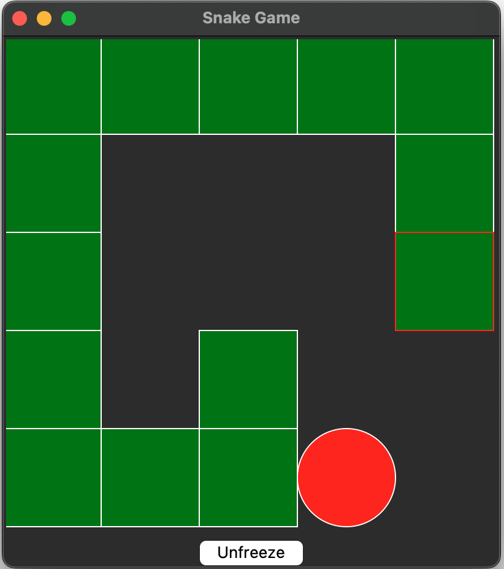

# Snake :

## File

Here is the list of the file in this project and what they are used for :

 - **displayData.py** : A script to see the preregistered game played by the IA (include a UI)

 - **liveDemo.py** : A script to see the IA play directly (include a UI)

 - **testGame.py** : A script to test the snake game by playing it yourself (include a UI)

 - **trainSnakeEvo.py** : The script that allow you to choose the parameter of the IA

 - **trainSnakeEvoTools.py** : The script that train the IA

 - **snakeGame.py** : The script that contain the code for the snake game and the different UI

 - **model (folder)** : This folder contain all of the trained IA